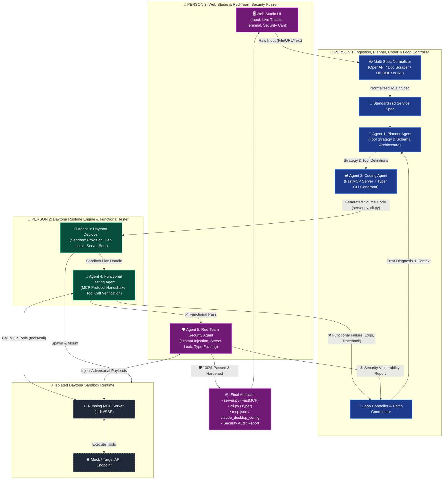

# MCP-Forge: Autonomous Daytona-Powered MCP & CLI Compiler

## 1. Product Overview & Core Flow

**MCP-Forge** is an autonomous multi-agent development engine that transforms raw API specifications, documentation, database schemas, or cURLs into verified, enterprise-hardened Model Context Protocol (MCP) servers and single-binary CLIs. 

Instead of generating raw, untested code, **MCP-Forge leverages Daytona Sandboxes** as an isolated runtime where it boots the generated server, executes dynamic functional integration tests, conducts red-team security fuzzing attacks, and self-heals in a feedback loop before publishing.

---

## 2. System Architecture & Domain Separation (HLD)



---

## 3. Clarification of Input Types & Ingestion Layer

The Ingestion Layer normalizes heterogeneous input sources into a single **`StandardizedServiceSpec`**:

| Input Type | What It Means & How It's Processed | Extracted Artifacts |
| :--- | :--- | :--- |
| **OpenAPI / Swagger (JSON/YAML)** | Machine-readable API definitions (e.g. Petstore, Stripe, Notion). Fast & deterministic. | Endpoints, HTTP methods, parameter schemas, request bodies, auth types. |
| **Documentation (URL or Markdown)** | Web docs of an API (e.g. Scraped HTML or Markdown files). Agent parses endpoint tables, code snippets, and params. | Synthesized endpoint list, parameter types, query/header formats. |
| **Database Schema (SQL DDL / SQLite)** | Database tables, schema definitions, or connection strings. | Table definitions, primary keys, relationships $\rightarrow$ Generates CRUD tools (`query`, `insert`, `filter`). |
| **cURL Snippets** | Raw `curl -X POST https://api.com/... -H ... -d ...` examples. | Endpoint URLs, Headers, Body payloads inferred into tool specs. |

---

## 4. Module Interface Contracts (Inputs & Outputs)

### Interface 1: Ingestion $\rightarrow$ Planner
```json
{
  "service_name": "GitHubMini",
  "base_url": "https://api.github.com",
  "auth_type": "bearer",
  "tools": [
    {
      "name": "create_issue",
      "description": "Creates a new issue in a repository",
      "method": "POST",
      "path": "/repos/{owner}/{repo}/issues",
      "parameters": {
        "owner": {"type": "string", "required": true},
        "repo": {"type": "string", "required": true},
        "title": {"type": "string", "required": true},
        "body": {"type": "string", "required": false}
      }
    }
  ]
}
```

### Interface 2: Coding Agent $\rightarrow$ Daytona Deployer
```json
{
  "files": {
    "server.py": "from mcp.server.fastmcp import FastMCP\n...",
    "cli.py": "import typer\n...",
    "requirements.txt": "mcp>=1.0.0\nrequests>=2.31.0\ntyper>=0.9.0\n",
    "test_driver.py": "..."
  },
  "runtime": "python:3.11",
  "entrypoint": "python server.py"
}
```

### Interface 3: Testing / Security Agent $\rightarrow$ Loop Controller (Feedback)
```json
{
  "stage": "functional_test" | "security_fuzzing",
  "status": "FAIL",
  "tool_name": "create_issue",
  "payload_tested": {"owner": "test", "repo": "test", "title": "<script>alert(1)</script>"},
  "error_message": "ValidationError: title parameter not properly sanitized",
  "traceback": "Traceback (most recent call last):\n...",
  "suggested_fix": "Add input sanitization and length bounds to title parameter"
}
```

---

## 5. Team 3-Person Action Plan & Execution Roadmap

### 👤 Person 1: Core Engine, Ingestion & Agent Loop Controller
- **Goal:** Ingest inputs, run Agent 1 (Planner) and Agent 2 (Coder), and coordinate the self-healing loop.
- **Key Tasks:**
  1. Build `ingest.py` supporting OpenAPI JSON and cURL parsing.
  2. Implement `planner_agent.py` using LLM prompt to design tool schemas.
  3. Implement `coder_agent.py` generating FastMCP Python server and Typer CLI code.
  4. Implement `orchestrator.py` that receives feedback from Daytona tests/security and triggers re-generation.
- **Immediate Deliverable:** Standalone script that takes `swagger.json` and outputs `server.py` and `cli.py`.

### 👤 Person 2: Daytona Sandbox Runtime & Functional Tester
- **Goal:** Manage Daytona Sandbox lifecycle, deploy generated MCP code, and execute live functional handshake tests.
- **Key Tasks:**
  1. Build `daytona_runner.py` using `Daytona` Python SDK (`daytona.create()`, `fs.upload_file`, `process.exec()`).
  2. Create a generic `mcp_test_client.py` that boots inside Daytona, lists tools, sends sample payloads, and asserts non-500 responses.
  3. Collect stdout, stderr, and exit codes into a structured `TestReport`.
- **Immediate Deliverable:** Script that takes any `server.py`, deploys it into a Daytona sandbox, executes a test tool call, and returns the result.

### 👤 Person 3: Red-Team Security Fuzzer & Interactive Web Studio UI
- **Goal:** Build Agent 5 (Security Attack Fuzzer) and the Streamlit/Web Studio dashboard.
- **Key Tasks:**
  1. Build `security_agent.py`:
     - Test 1: **Secret Leakage** (Verifies API keys are not printed in tool logs or errors).
     - Test 2: **Prompt Injection / XSS in parameters** (Sends malicious payloads to test escaping).
     - Test 3: **Type & Range Boundary Fuzzing** (Negative numbers, null bytes, oversized payloads).
  2. Build `app.py` (Streamlit Web Studio):
     - File upload / API URL input box.
     - Live execution stream showing multi-agent status badges.
     - Security Audit Scorecard (Clean / Vulnerable / Remediated).
     - Download buttons for the final MCP bundle.
- **Immediate Deliverable:** Streamlit UI mockup with input tabs and Security test suite runner.
