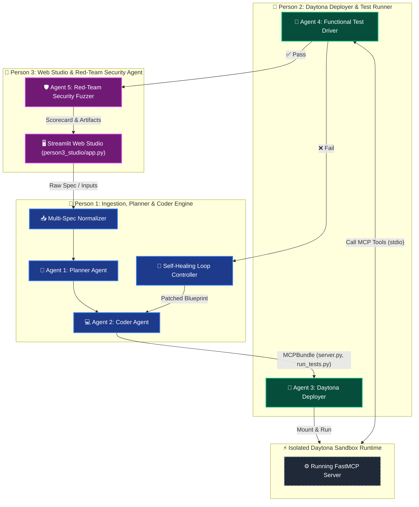

# ⚡ MCP-Forge: Autonomous Daytona-Powered MCP Compiler

> Built during the **Daytona HackSprint Singapore (August 2026)**.

**MCP-Forge** is an autonomous multi-agent compilation engine that transforms any OpenAPI spec, Swagger JSON, or cURL request into an enterprise-hardened **Model Context Protocol (MCP)** server and automated test harness—verified and self-healed inside **Daytona Sandboxes**.

---

## 🏗️ Architecture & 3-Person Team Separation



---

## 📂 Project Structure

```
├── shared/                         # Shared Pydantic data models & contracts
│   ├── __init__.py
│   └── models.py                   # Strict schemas (RawUIPayload, TestReport, FeedbackReport)
│
├── person1_compiler/               # 👤 Person 1: Core Compiler Pipeline
│   ├── __init__.py
│   ├── ingest.py                   # Spec Normalizer (OpenAPI 3.0, Swagger 2.0, cURL)
│   ├── planner.py                  # Agent 1: Planner Agent (LLM + Rule-based fallback)
│   ├── coder.py                    # Agent 2: Coder Agent (FastMCP generator & Test Harness)
│   ├── pipeline.py                 # End-to-end Compiler & Self-Healing Entrypoint
│   ├── benchmark.py                # Quality & Similarity Evaluator vs Reference MCPs
│   └── sample_inputs/              # Showcase API Specifications
│       └── raw_github_input.json   # GitHub Issues & Repos Showcase Spec
│
├── person2_daytona/                # 👤 Person 2: Daytona Runtime Engine
│   ├── __init__.py
│   ├── deploy_agent.py             # Agent 3: Daytona Sandbox Provisioning & Mounting
│   └── test_agent.py               # Agent 4: Daytona Functional Test Driver
│
├── person3_studio/                 # 👤 Person 3: UI & Security
│   ├── __init__.py
│   ├── app.py                      # Interactive Streamlit Web Studio
│   └── security_agent.py           # Agent 5: Red-Team Security Fuzzer (Leak/Injection/Overflow)
│
└── docs/                           # Team Contract Documents
    ├── PRD.md                      # Product Requirements Document
    ├── LLD_CONTRACTS.md            # Low-Level Design & Data Contracts
    ├── UI_SPEC_PERSON3.md          # Guide for Person 3
    ├── DAYTONA_SPEC_PERSON2.md     # Guide for Person 2
    └── FEEDBACK_CONTRACT.md        # Self-Healing Feedback Loop Schema
```

---

## 🚀 Quickstart

### 1. Install Dependencies
```bash
pip install daytona mcp httpx pydantic python-dotenv streamlit
```

### 2. Configure Environment
```bash
cp .env.example .env
# Add your DAYTONA_API_KEY and OPENAI_API_KEY in .env
```

### 3. Launch the Studio UI
```bash
streamlit run person3_studio/app.py
```

### 4. Run the CLI Benchmark
```bash
python -m person1_compiler.benchmark
```
