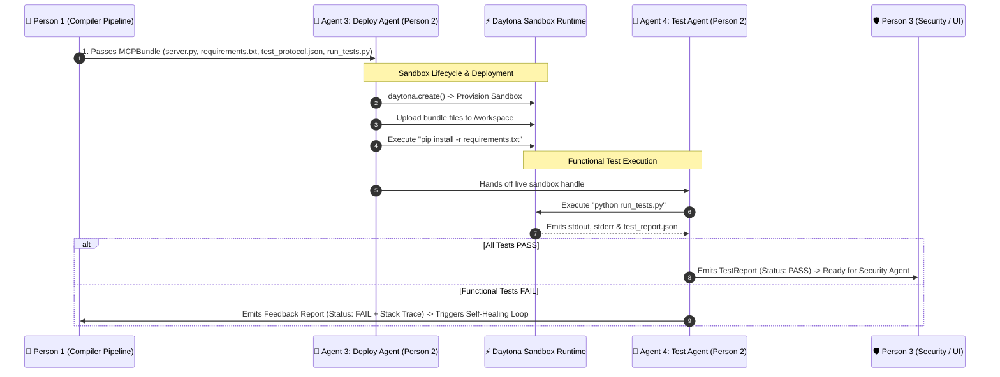

# Daytona Sandbox Engine & Testing Contract (Person 2 Guide)

> **Role of Person 2:**  
> You are building two specialized agents:
> 1. **Agent 3: Deploy Agent** (Manages Daytona Sandbox lifecycle, uploads code bundle, installs dependencies, boots MCP server).
> 2. **Agent 4: Test Agent** (Executes functional MCP handshake, calls each tool over stdio, and produces a structured test report).

---

## 1. System Interaction & Communication Flow



---

## 2. Input Contract (What Person 1 Gives to Person 2)

Person 1 will provide a Python dictionary or JSON object representing the **`MCPBundle`**:

```json
{
  "server.py": "<String content of FastMCP server>",
  "requirements.txt": "mcp>=1.0.0\nhttpx>=0.28.0\npydantic>=2.0.0\npython-dotenv>=1.0.0\n",
  "test_protocol.json": {
    "service_name": "PetStore",
    "tests": [
      {
        "tool_name": "get_pet_by_id",
        "description": "Fetch pet details by ID",
        "test_payload": {"petId": 1},
        "expected_status": "success"
      }
    ]
  },
  "run_tests.py": "<String content of automated test driver script>",
  "env_vars": {
    "API_KEY": "sample_or_live_token_for_sandbox",
    "API_BASE_URL": "https://api.petstore.com/v2"
  }
}
```

---

## 3. Output Contract (What Person 2 Returns on Success)

When all functional tests pass, Agent 4 emits this **`TestReport`** JSON to the team:

```json
{
  "status": "PASS",
  "stage": "functional_testing",
  "sandbox_id": "sb-daytona-8f92a10",
  "execution_duration_ms": 1250,
  "summary": {
    "total_tools": 2,
    "passed_count": 2,
    "failed_count": 0
  },
  "tool_results": [
    {
      "tool_name": "get_pet_by_id",
      "status": "PASS",
      "latency_ms": 210,
      "response_sample": "{\"id\": 1, \"name\": \"doggie\", \"status\": \"available\"}",
      "error": null
    },
    {
      "tool_name": "create_pet",
      "status": "PASS",
      "latency_ms": 340,
      "response_sample": "{\"id\": 102, \"name\": \"fluffy\", \"status\": \"pending\"}",
      "error": null
    }
  ],
  "raw_logs": "[INFO] MCP Server started on stdio\n[INFO] Tested 2 tools successfully."
}
```

---

## 4. Failure & Self-Healing Contract

If any tool fails or the server crashes, refer to **`FEEDBACK_CONTRACT.md`** for the exact schema to send back to Person 1 to trigger automated code repair.
