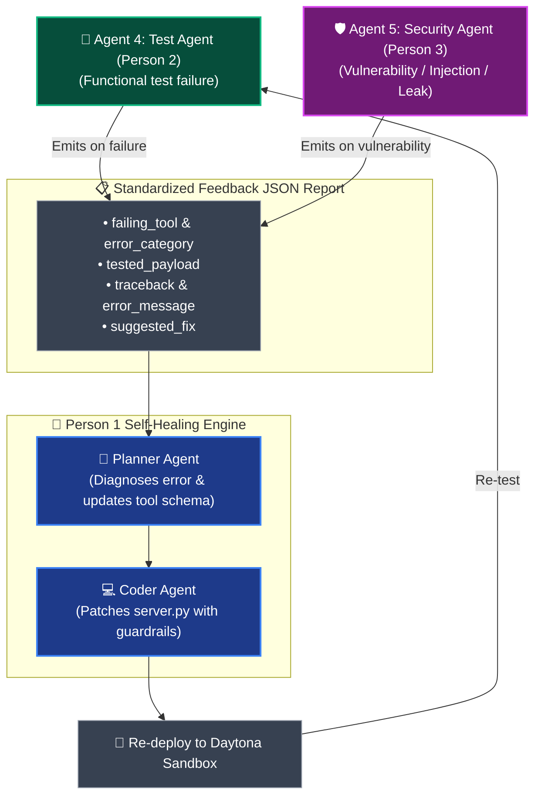

# Self-Healing Feedback Contract (Shared with Person 2 & Person 3)

> **Purpose:**  
> Whenever **Agent 4 (Functional Test Agent - Person 2)** or **Agent 5 (Security Red-Team Agent - Person 3)** detects a bug, crash, or security vulnerability in the Daytona sandbox, they must emit this structured JSON payload.  
> **Person 1's Planner & Coder agents** will automatically ingest this report, diagnose the root cause, patch `server.py`, and re-deploy.

---

## 1. Self-Healing Feedback Loop Architecture



---

## 2. The Unified Feedback JSON Schema

```json
{
  "$schema": "http://json-schema.org/draft-07/schema#",
  "status": "FAIL",
  "stage": "functional_test | security_fuzzing",
  "sandbox_id": "sb-daytona-8f92a10",
  "failing_tool": "create_issue",
  "error_category": "http_status_error | runtime_crash | syntax_error | secret_leakage | prompt_injection | type_validation_error",
  "tested_payload": {
    "owner": "octocat",
    "repo": "Hello-World",
    "title": "<script>alert(1)</script>"
  },
  "error_message": "HTTP Error 422: Unprocessable Entity - Title contains invalid control characters",
  "traceback": "Traceback (most recent call last):\n  File 'server.py', line 48, in create_issue\n    response.raise_for_status()\nhttpx.HTTPStatusError: 422 Unprocessable Entity",
  "suggested_fix": "Add sanitization and regex validation on the 'title' parameter before dispatching HTTP request."
}
```

---

## 3. Error Categories & Meaning

| `error_category` | Emitted By | Trigger Condition | How Person 1 Fixes It |
| :--- | :---: | :--- | :--- |
| **`syntax_error`** | Person 2 | `server.py` failed to import or start up. | Coder Agent fixes indentation, missing imports, or syntax. |
| **`runtime_crash`** | Person 2 | Unhandled exception inside tool execution. | Coder Agent wraps block in proper `try...except` boundary. |
| **`http_status_error`** | Person 2 | Target API returned 4xx or 5xx status code. | Planner checks parameter mapping (e.g. query param vs body). |
| **`type_validation_error`**| Person 2 / 3 | Argument failed Pydantic type validation. | Planner corrects Python type annotation (e.g. `int` vs `str`). |
| **`secret_leakage`** | Person 3 | `API_KEY` was detected in tool response text. | Coder masks headers/tokens from response sanitization filter. |
| **`prompt_injection`** | Person 3 | Malicious parameter payload corrupted prompt. | Coder adds strict character escaping and length limits. |

---

## 4. Python Contract Function (Direct Call Interface)

If calling Person 1 directly in code:

```python
from pipeline import apply_feedback_and_recompile

# When Person 2 or Person 3 detects a failure:
feedback_report = {
    "status": "FAIL",
    "stage": "functional_test", # or "security_fuzzing"
    "failing_tool": "create_pet",
    "error_category": "http_status_error",
    "tested_payload": {"petId": -1},
    "error_message": "HTTP 404: Pet not found",
    "traceback": "...",
    "suggested_fix": "Ensure petId is positive integer > 0"
}

# Returns patched MCP bundle:
repaired_bundle = apply_feedback_and_recompile(feedback_report)
# repaired_bundle contains the updated server.py ready for re-deployment!
```
