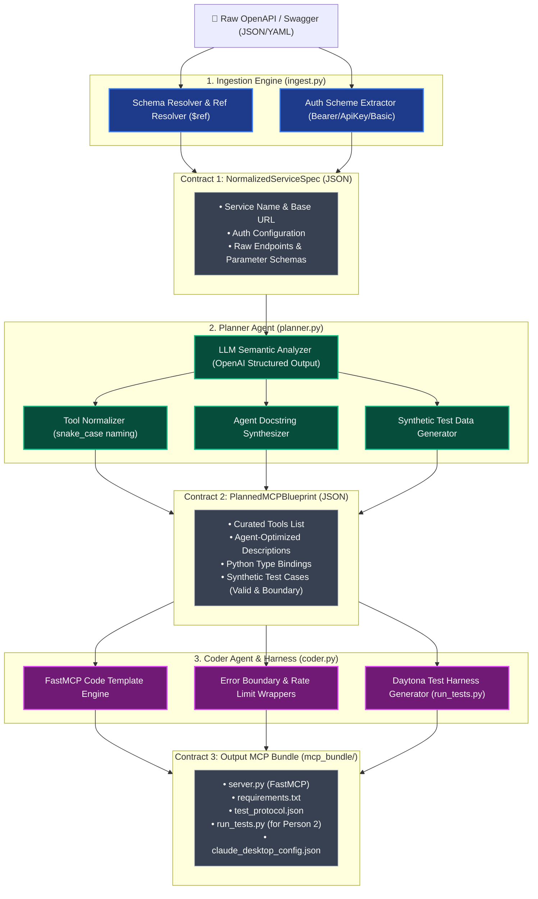

# Low-Level Design (LLD) & Data Contracts: Person 1 Pipeline

## 1. Real-World Demo API Recommendations

| Candidate API | Why It Fits for Hackathon Demo | Key Tools Generated |
| :--- | :--- | :--- |
| **Option A: GitHub Issues API** *(Recommended)* | Universally understood, proves real developer utility, authenticated (`GITHUB_TOKEN`). | `list_issues`, `create_issue`, `get_repo_info`, `add_issue_comment`. |
| **Option B: Open-Meteo Weather API** | **Zero authentication required**, 100% reliable for live onstage Daytona sandbox demos. | `get_current_weather`, `get_hourly_forecast`, `geocode_city`. |
| **Option C: Resend Email API** | Clear agent use case (email notifications), clean modern OpenAPI spec. | `send_email`, `get_email_status`, `list_api_keys`. |

---

## 2. Low-Level Architecture & Data Flow



---

## 3. Strict Contract Definitions (Pydantic / JSON Schema)

### Contract 1: Ingestion $\rightarrow$ Planner (`NormalizedServiceSpec`)

```python
class ParameterLocation(str, Enum):
    PATH = "path"
    QUERY = "query"
    HEADER = "header"
    BODY = "body"

class ParameterDefinition(BaseModel):
    name: str
    location: ParameterLocation
    type: str  # "string", "integer", "boolean", "number", "array", "object"
    description: str = ""
    required: bool = True
    default: Optional[Any] = None
    enum_values: Optional[List[str]] = None

class RawEndpoint(BaseModel):
    operation_id: Optional[str] = None
    path: str
    method: str  # GET, POST, PUT, DELETE, PATCH
    summary: str = ""
    description: str = ""
    parameters: List[ParameterDefinition] = Field(default_factory=list)
    request_body_schema: Optional[Dict[str, Any]] = None
    response_codes: List[int] = Field(default_factory=lambda: [200])

class AuthScheme(BaseModel):
    auth_type: str  # "none", "bearer", "api_key", "basic"
    header_name: str = "Authorization"
    query_param_name: Optional[str] = None
    env_var_name: str = "API_KEY"

class NormalizedServiceSpec(BaseModel):
    service_name: str
    base_url: str
    auth: AuthScheme
    endpoints: List[RawEndpoint]
```

---

### Contract 2: Planner $\rightarrow$ Coder (`PlannedMCPBlueprint`)

```python
class PlannedToolParameter(BaseModel):
    name: str
    python_type: str  # "str", "int", "float", "bool", "Optional[str]", etc.
    description: str
    required: bool
    location: ParameterLocation
    default_value: Optional[str] = None

class PlannedTestCase(BaseModel):
    test_id: str
    description: str
    input_arguments: Dict[str, Any]
    expected_http_status: int = 200

class PlannedTool(BaseModel):
    tool_name: str  # e.g., "get_user_by_username"
    docstring: str  # Formatted for LLMs: "Retrieves user account info. Use when..."
    http_method: str
    endpoint_path: str
    parameters: List[PlannedToolParameter]
    test_cases: List[PlannedTestCase]  # Minimum 1 valid case + 1 edge case

class PlannedMCPBlueprint(BaseModel):
    service_name: str
    base_url: str
    auth: AuthScheme
    tools: List[PlannedTool]
    system_instruction: str  # High-level context for the LLM host
```

---

### Contract 3: Coder $\rightarrow$ Person 2 / Daytona (`test_protocol.json`)

```json
{
  "$schema": "http://json-schema.org/draft-07/schema#",
  "service_name": "GitHubMini",
  "server_entrypoint": "server.py",
  "auth_env_var": "GITHUB_TOKEN",
  "test_suites": [
    {
      "tool_name": "list_issues",
      "tests": [
        {
          "test_id": "test_list_issues_happy_path",
          "arguments": {
            "owner": "octocat",
            "repo": "Hello-World",
            "state": "open"
          },
          "expected_status": "success",
          "validate_json": true
        }
      ]
    }
  ]
}
```

---

## 4. Module Internal Logic & Responsibilities

### Module 1: Ingestion Engine (`ingest.py`)
1. **Input Normalization:** Ingests string JSON/YAML or file path.
2. **Schema & Ref Resolution:** Resolves `$ref` pointers (e.g. `#/components/schemas/Pet`) into inline parameter definitions.
3. **Auth Extraction:** Checks `securityDefinitions` (Swagger 2.0) or `components.securitySchemes` (OpenAPI 3.0) to automatically infer whether the API needs Bearer tokens or API keys.

### Module 2: Planner Agent (`planner.py`)
1. **LLM Schema Extraction:** Uses OpenAI Structured Outputs (`response_format=PlannedMCPBlueprint`) with a rigorous prompt.
2. **Prompt Directives:**
   - Enforces `snake_case` naming (`verb_noun`).
   - Writes concise, unambiguous docstrings targeted at LLM agent tool selection.
   - Generates realistic, non-destructive test arguments (e.g. read operations or mock ids).

### Module 3: Coder Agent (`coder.py`)
1. **Code Generation:** Assembles the FastMCP template with `@mcp.tool()` decorators.
2. **Security & Guardrails:**
   - Wraps external HTTP calls in `try...except httpx.HTTPStatusError` with clean status reporting.
   - Enforces timeouts (`timeout=30.0`) to avoid hanging Daytona sandbox executions.
   - Sanitizes error outputs so internal stack traces or environment variables are not leaked to the LLM.
3. **Daytona Harness Generator (`run_tests.py`):**
   - Automatically writes a standalone test runner script that spawns `server.py` via `mcp.client.stdio.stdio_client`, sends the JSON-RPC test payloads from `test_protocol.json`, and records pass/fail status.
