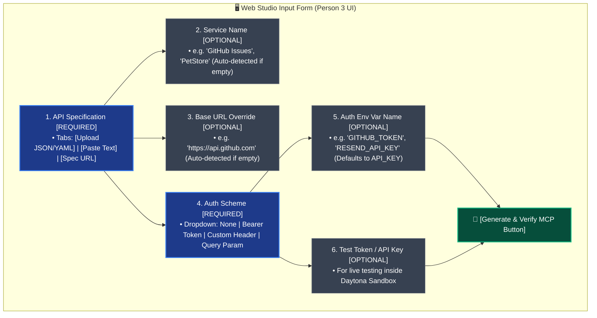

# Web Studio UI Input Specification & Contract (Person 3 Guide)

> **Note to Person 3:**  
> The visual layout and styling of the UI can be customized to your preference. However, **the data fields and the JSON contract schema defined below are strict requirements** so that Person 1's ingestion and planning pipeline can process the inputs seamlessly.

---

## 1. Suggested UI Wireframe



---

## 2. Form Field Definitions

| Field Key | UI Label & Type | Required? | Default Value | Notes / Description |
| :--- | :--- | :---: | :--- | :--- |
| **`spec_content`** | **API Specification**<br/>*(File Uploader / Text Area / URL)* | **YES** | *None* | Raw OpenAPI 3.0 / Swagger 2.0 JSON or YAML content. |
| **`spec_format`** | **Specification Format**<br/>*(Radio / Dropdown)* | **YES** | `"openapi_json"` | Allowed values: `"openapi_json"`, `"openapi_yaml"`, `"curl"`. |
| **`service_name`** | **Service Name**<br/>*(Text Input)* | NO | `null` | Display name of the service (e.g. `"GitHubMini"`). Auto-extracted from spec if blank. |
| **`base_url`** | **Base URL Override**<br/>*(Text Input)* | NO | `null` | API base domain (e.g. `"https://api.github.com"`). Auto-extracted from spec if blank. |
| **`auth_type`** | **Authentication Type**<br/>*(Dropdown / Select)* | **YES** | `"bearer"` | Options: `"none"`, `"bearer"`, `"header"`, `"query"`. |
| **`header_name`** | **Header Name**<br/>*(Text Input)* | NO | `"Authorization"` | Only used if `auth_type` is `"header"` (e.g. `"X-API-Key"`). |
| **`env_var_name`** | **Environment Variable Name**<br/>*(Text Input)* | NO | `"API_KEY"` | The env variable name read by the MCP server (e.g. `"GITHUB_TOKEN"`). |
| **`test_token`** | **Live Test API Key**<br/>*(Password Input)* | NO | `null` | Optional real/test token mounted inside Daytona Sandbox to test live API calls. |

---

## 3. Strict JSON Data Contract (Person 3 $\rightarrow$ Person 1)

When the user clicks the submit/generate button, Person 3's UI must pass this exact dictionary / JSON payload to Person 1's pipeline:

```json
{
  "spec_format": "openapi_json",
  "spec_content": "{ \"swagger\": \"2.0\", \"info\": { \"title\": \"PetStore\" }, \"paths\": { ... } }",
  "service_name": "PetStore",
  "base_url": "https://petstore.swagger.io/v2",
  "auth": {
    "auth_type": "bearer",
    "header_name": "Authorization",
    "query_param_name": null,
    "env_var_name": "PETSTORE_API_KEY",
    "test_token": "optional_token_for_daytona_live_testing"
  }
}
```

---

## 4. Python Contract Function (Direct Call Interface)

If Person 3 is calling Person 1 directly in Python (e.g., within Streamlit):

```python
# In Person 3's app.py:
from pipeline import compile_to_mcp

raw_payload = {
    "spec_format": spec_format,       # "openapi_json" | "openapi_yaml" | "curl"
    "spec_content": spec_content_str, # raw string
    "service_name": service_name,     # Optional[str]
    "base_url": base_url,             # Optional[str]
    "auth": {
        "auth_type": auth_type,       # "none" | "bearer" | "header" | "query"
        "header_name": header_name,   # Optional[str]
        "query_param_name": None,
        "env_var_name": env_var_name, # e.g. "GITHUB_TOKEN"
        "test_token": test_token      # Optional[str]
    }
}

# Person 1's function returns the MCP bundle:
result = compile_to_mcp(raw_payload)
# result = {
#     "server.py": "...",
#     "requirements.txt": "...",
#     "test_protocol.json": {...},
#     "run_tests.py": "..."
# }
```
