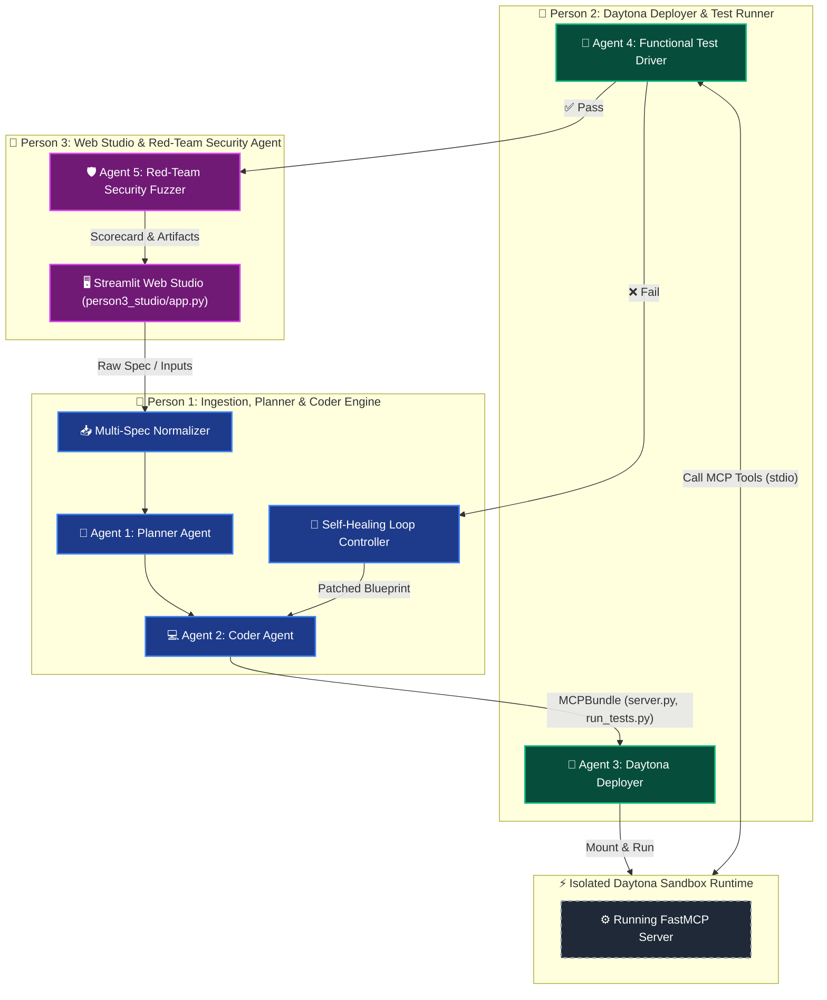

# 🧠 Project Context & Memory Tracker (`gemini.md`)

## 1. Project Identity & Mission
- **Project Name:** **MCP-Forge** (Autonomous Daytona-Powered MCP & CLI Compiler)
- **Event:** Daytona HackSprint Singapore (August 29, 2026).
- **Core Value Proposition:** Transforms raw OpenAPI 3.0 / Swagger 2.0 / cURL specs into verified, enterprise-hardened Model Context Protocol (`FastMCP`) servers and test suites—tested, benchmarked, and self-healed inside **Daytona Sandboxes**.

---

## 2. 3-Person Team Responsibilities & Separation of Context



| Person | Focus Domain | Key Modules / Artifacts | Current Status |
| :--- | :--- | :--- | :--- |
| **👤 Person 1 (Our Role)** | Ingestion, Planner Agent, Coder Agent, Self-Healing Loop, Benchmark | `person1_compiler/`, `shared/models.py`, `sample_inputs/` | **✅ Fully Built & Tested (100/100 Benchmark)** |
| **👤 Person 2** | Agent 3 (Deploy Agent), Agent 4 (Test Agent), Daytona SDK Runtime | `person2_daytona/`, `docs/DAYTONA_SPEC_PERSON2.md` | ⏳ Pending Person 2 code push |
| **👤 Person 3** | Web Studio UI, Agent 5 (Red-Team Security Agent) | `person3_studio/`, `docs/UI_SPEC_PERSON3.md` | ⏳ Pending Person 3 code push |

---

## 3. Data Contracts & Cross-Module Interfaces

1. **Person 3 $\rightarrow$ Person 1 (Input Contract):**
   - Ingests `RawUIPayload` (`spec_format`, `spec_content`, `service_name`, `base_url`, `auth`).
   - Function: `compile_to_mcp(raw_payload)`.
2. **Person 1 $\rightarrow$ Person 2 (Daytona Bundle):**
   - Returns `MCPBundle` (`server.py`, `requirements.txt`, `test_protocol.json`, `run_tests.py`, `env_vars`).
3. **Person 2 / Person 3 $\rightarrow$ Person 1 (Self-Healing Loop):**
   - Emits `FeedbackReport` (`failing_tool`, `error_category`, `tested_payload`, `error_message`, `suggested_fix`).
   - Function: `apply_feedback_and_recompile(feedback)`.

---

## 4. Current File Layout

```
├── shared/
│   ├── __init__.py
│   └── models.py                   # Strict Pydantic models for all contracts
├── person1_compiler/
│   ├── __init__.py
│   ├── ingest.py                   # Spec Normalizer (OpenAPI 3.0, Swagger 2.0, cURL)
│   ├── planner.py                  # Agent 1: Planner Agent (LLM + Rule-based fallback)
│   ├── coder.py                    # Agent 2: Coder Agent (FastMCP generator & Test Harness)
│   ├── pipeline.py                 # Pipeline Orchestrator & Self-Healing Entrypoint
│   ├── benchmark.py                # Quality & Similarity Evaluator vs Reference MCPs
│   └── sample_inputs/
│       └── raw_github_input.json   # Showcase API Input
├── person2_daytona/
│   └── .gitkeep                    # Reserved for Person 2
├── person3_studio/
│   └── .gitkeep                    # Reserved for Person 3
├── docs/
│   ├── PRD.md
│   ├── LLD_CONTRACTS.md
│   ├── UI_SPEC_PERSON3.md
│   ├── DAYTONA_SPEC_PERSON2.md
│   └── FEEDBACK_CONTRACT.md
├── README.md
├── gemini.md                       # This context memory file
└── test_daytona.py                 # Daytona SDK environment test script
```

---

## 5. Milestone History & Next Steps
- **[Completed]** Git initialization, Daytona Python SDK environment setup.
- **[Completed]** Comprehensive PRD, LLD, and team contracts created in `docs/`.
- **[Completed]** Person 1 compiler pipeline implemented (Ingestion, Planner, Coder, Benchmark).
- **[Completed]** GitHub showcase example formulated and scored (100% Schema Completeness, 100% Security Hardening).
- **[Upcoming]** Integrate incoming code from Person 2 (Daytona Deploy/Test agents) and Person 3 (Web UI/Security agent).
